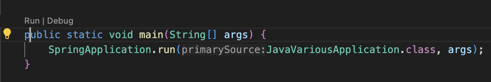

# 目次

<!-- TOC -->

- [目次](#目次)
- [概要](#概要)
- [コマンド](#コマンド)
- [エラー](#エラー)
  - [Error: Main method not found in the file~](#error-main-method-not-found-in-the-file)
  - [Incompatible because this component declares~](#incompatible-because-this-component-declares)
- [関連情報](#関連情報)

<!-- /TOC -->

# 概要

- 目的
  - Java のキャッチアップ、検証環境、個人用ツール、なんでも入れる。
- 参考教材
  - [実践 SpringBoot \~SpringBoot Advanced Tutorial\~](https://www.techpit.jp/courses/232)
- 使用技術
  - Java
  - SpringBoot
  - MySQL
  - Gradle

# コマンド

```bash
# gradle のビルド
./gradlew build
```

# エラー

## Error: Main method not found in the file~

- エラー詳細
  - Error: Main method not found in the file, please define the main method as: public static void main(String[] args)
  - Run が main 関数のところに出なかったので、右クリックして Run Java というやつをクリックした
- 解決時やったこと

  - すでに動作している別リポジトリ javaCrud を見て Run する方法を確認
  - VSCode の Reload Window を実行
  - そもそも main 関数に表示されていなかった Run が表示されて解決
  - ↓ みたいな感じで結構見えにくい。
    

- 解決しない時に見た記事
  - [workspaceStorage フォルダを消す](https://teratail.com/questions/t2833q7nv8wior)
  - [シンタックスの見直し](https://ameblo.jp/taktak0/entry-12372913263.html)

## Incompatible because this component declares~

- エラー詳細
  - Incompatible because this component declares a component, compatible with Java 17 and the consumer needed a component, compatible with Java 13
  - ローカル環境が Java 13 で、プロジェクトが Java 17 だった。
  - `./gradlew build`を実行した時に出た。
- 解決時やったこと
  - ローカル環境の Java をアップデート
  - 21 になったが動いている
  - [大まかな流れの参考記事 ※記事ないは zsh なので、bash 環境の場合注意](https://zenn.dev/hayato94087/articles/c0345e6c2c53e7)
  - 以下を bash_profile に書いて、`source ~/.bash_profile`を実行
  - `java -version`、`./gradlew build`を問題なく実行できた。

```bash
# ~/.bash_profile
export PATH="/usr/local/opt/openjdk/bin:$PATH"
export JAVA_HOME="/usr/local/opt/openjdk"
```

# 関連情報

- [javaCrud（簡易サンプルリポジトリ）](https://github.com/jun0222/javaCrud)
